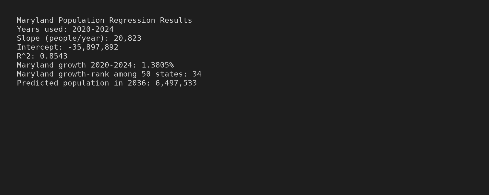
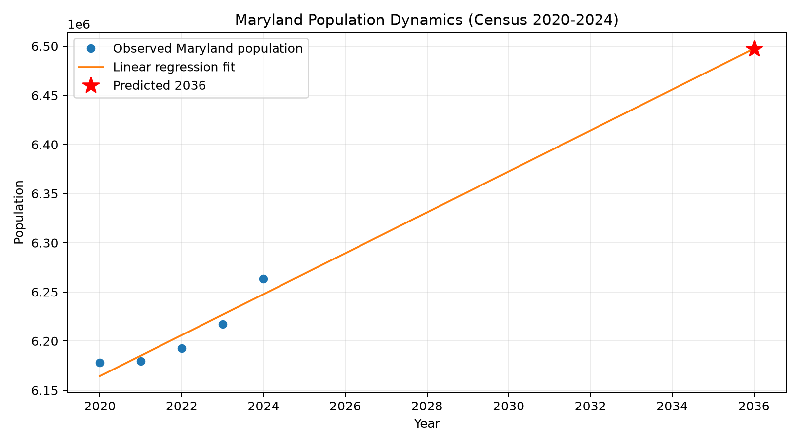

# Benchmark-Population-Size-of-State

## Part I: Contextualization (Quick Introduction)
This report models Maryland’s recent population dynamics using the U.S. Census Bureau annual state estimates (2020–2024) and a simple linear regression. The goal is to quantify short-run trend direction, compare Maryland’s growth against other states, and produce a 10-year-ahead forecast using a transparent baseline model.

### 1) Data download and preparation
- Source file used: `NST-EST2024-ALLDATA.csv` (U.S. Census Bureau Population Estimates Program, 2020s state totals) [R1][R2].
- Local copy path in this repository: `/home/runner/work/Benchmark-Population-Size-of-State/Benchmark-Population-Size-of-State/data/NST-EST2024-ALLDATA.csv`.
- Preparation steps implemented in `/home/runner/work/Benchmark-Population-Size-of-State/Benchmark-Population-Size-of-State/analyze_maryland_population.py`:
  - Read CSV with `csv.DictReader`.
  - Keep state-level rows (`SUMLEV == 040`).
  - Limit ranking set to the 50 U.S. states (exclude District of Columbia and Puerto Rico).
  - Extract Maryland yearly estimates (`POPESTIMATE2020` to `POPESTIMATE2024`) for model fitting.

### 2) Linear regression model for Maryland
- Model form: \( \hat{y} = \beta_0 + \beta_1 \cdot \text{year} \)
- Fitted on Maryland data for years 2020–2024.
- Estimated slope: **20,823 people/year**.
- Intercept: **-35,897,892**.
- Goodness of fit: **R² = 0.8543**.

Interpretation: during 2020–2024, the fitted linear trend implies Maryland added about 20.8k residents per year on average in this period.

### 3) Maryland’s population growth-rate ranking
- Growth metric used: percent change from 2020 to 2024:
  \[
  \text{growth \%} = \frac{\text{POPESTIMATE2024} - \text{POPESTIMATE2020}}{\text{POPESTIMATE2020}} \times 100
  \]
- Maryland’s growth (2020→2024): **1.3805%**.
- Maryland rank among the 50 states by this metric: **34th**.

### 4) 10-year prediction from now
- “Ten years from now” is interpreted from the assignment timestamp year 2026, so target year = **2036**.
- Forecast from the fitted model:
  - **Predicted Maryland population in 2036: 6,497,533**.

---

## Part II: Planning and Reporting (Quick Introduction)
This section summarizes the complete workflow (tool choice, preparation, modeling, diagnostics, and limits), and documents evidence for reproducibility.

### 1) Programming tool and justification
- Tool: **Python** (standard library + `matplotlib` for visuals).
- Why this was selected:
  - Reproducible script-based workflow.
  - Native CSV handling for Census flat files.
  - Easy generation of both numeric outputs and graphics in one run.

### 2) Data preparation + script use + screenshot of results
- Script: `/home/runner/work/Benchmark-Population-Size-of-State/Benchmark-Population-Size-of-State/analyze_maryland_population.py`
- Input: `/home/runner/work/Benchmark-Population-Size-of-State/Benchmark-Population-Size-of-State/data/NST-EST2024-ALLDATA.csv`
- Run command:
  ```bash
  python analyze_maryland_population.py
  ```
- Result screenshot (generated by the script):



### 3) Graphical model representation and prediction
The following chart shows observed Maryland population points (2020–2024), the fitted linear trend, and the 2036 forecast marker.



### 4) Limitations of the data
- Only 5 annual points are used for the Maryland fit (2020–2024), so long-cycle effects are underrepresented [R1][R2].
- Census estimates are revised as methods and source inputs update; future vintages can shift historical estimates [R2].
- State-level totals do not separate structural drivers (births, deaths, migration) within the regression itself.

### 5) Model assumptions
- Linear trend adequacy over forecast horizon.
- Relationship between year and population is stable enough to extrapolate.
- Residual shocks are not systematically changing over time.
- No major structural breaks (policy, macroeconomic, migration regime shifts) invalidate trend continuation.

### 6) Limitations of the model
- Extrapolation risk rises as forecast horizon increases (2036 is beyond observed sample).
- Linear form cannot capture turning points, nonlinear migration cycles, or sudden shocks.
- Small sample size (n=5) constrains robust inference.

### 7) Model performance assessment
- In-sample fit is moderate-to-strong (**R² = 0.8543**) for a simple one-variable trend model.
- Slope sign and magnitude align with observed post-2020 Maryland recovery trend in the selected window.

### 8) Fit assessment to data
- Visual fit is reasonable: line tracks the upward trajectory after the 2021 low.
- Residual interpretation should be cautious due to very short history.
- Model is appropriate as a baseline benchmark, not a full demographic forecasting system.

---

## Reproducibility Output Summary
From the script run:
- Slope: 20,823 people/year
- R²: 0.8543
- Maryland growth 2020→2024: 1.3805%
- Maryland growth rank: 34/50
- 2036 prediction: 6,497,533

---

## References
- **[R1]** U.S. Census Bureau. *State Population Totals and Components of Change: 2020–2024*. https://www.census.gov/data/tables/time-series/demo/popest/2020s-state-total.html
- **[R2]** U.S. Census Bureau. *Population and Housing Unit Estimates Program (methods/technical documentation and vintage estimates context).* https://www.census.gov/programs-surveys/popest.html
- **[R3]** Montgomery, D. C., Peck, E. A., & Vining, G. G. *Introduction to Linear Regression Analysis* (general assumptions and linear model diagnostics concepts).
